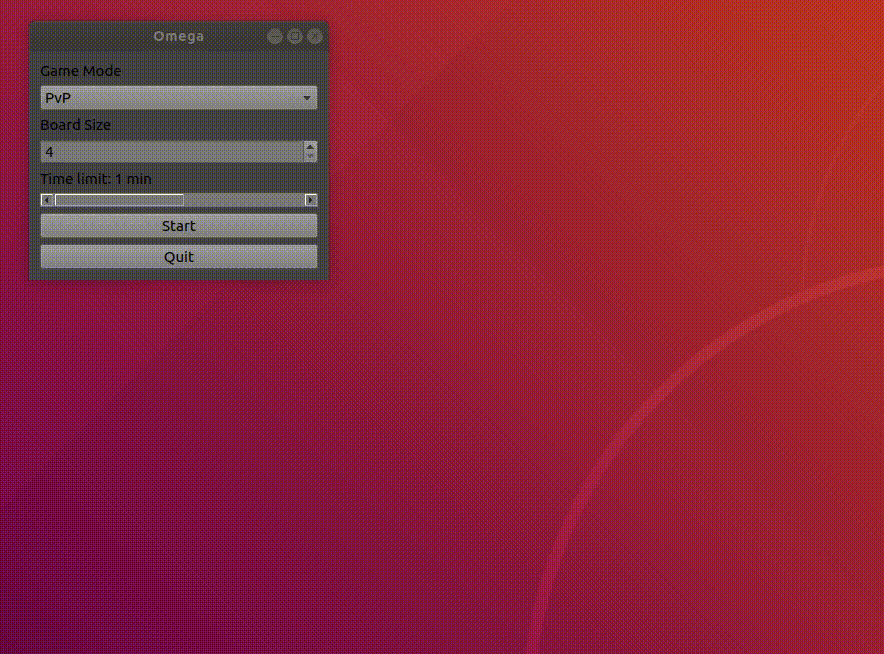

# Omega
### Description
Omega board game with C++ game engine and graphical interface implemented in Qt.

### Requirements
Download QT Creator and run project:
https://www.qt.io/download-open-source

### TODOS
Add AI bot based on monte carlo tree search, transposition table and alpha-beta pruning.

### Acknowledgements
https://www.redblobgames.com/grids/hexagons/

